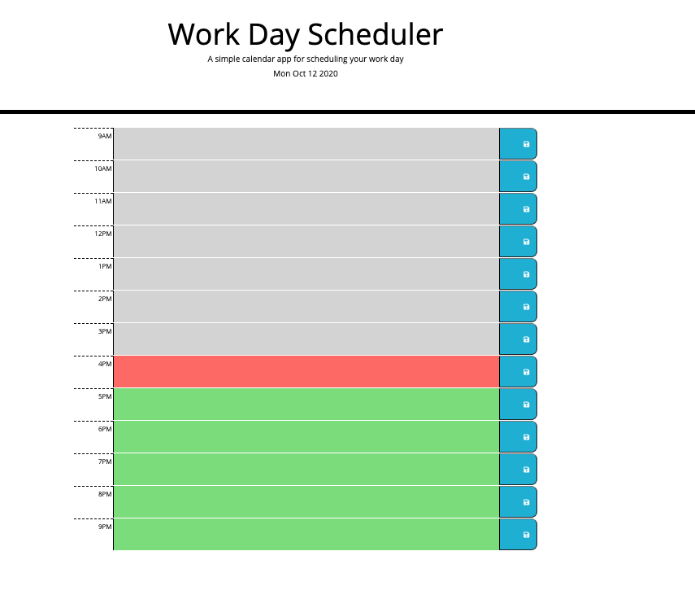
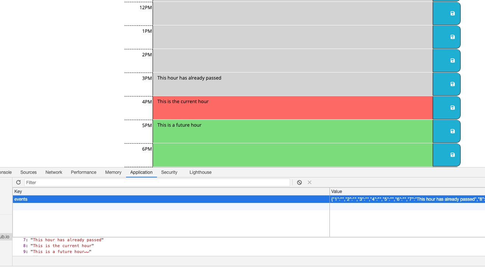

# 05 Third-Party APIs: Work Day Scheduler

## Overview of project

I created a  calendar application that allows a user to save events for each hour of the day (between 9am and 9pm). This app run in the browser and is powered by jQuery.

## User Experience

```

User can add important events to a daily planner by selecting each text block, writing in text for that hour, and then pressing the blue save icon. 

Pressing the blue save icon saves your response to local storage. 
```


## Images of the application

**The following screenshots display the applications functionality:**

### Overview of planner image

### Planner with inputs 

### Local storage example



